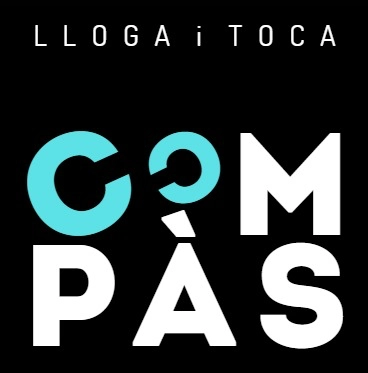

<p align="center"></p>

## Compàs - LLoga i Toca (Frontend)
React + Vite + TypeScript frontend for **Compàs - LLoga i Toca**.  
Consumes a **Laravel 12 REST API** with **Passport token auth** (Bearer token).  
UI includes instruments, reservations, meetings and calendar.

---

## Features

### Auth (Passport)
- Register / Login / Logout
- Persist token in localStorage (`auth_token`)
- Protected routes under `/app/*`

### User features
- Instruments: list + reserve instrument
- Reservations: view mine (ACTIVE / FINISHED), return, delete history (single + bulk)
- Meetings: view my meetings and all meetings, join / quit
- Calendar: week view, create meeting by selecting time range, click meeting for details, join / quit

### Admin features
- Instruments: CRUD + image upload (file picker, multipart)
- Reservations: view all reservations
- Meetings: admin shows only ALL meetings by default, can delete and update status
- Calendar: admin can see all meetings

---

## Tech stack
- React + Vite + TypeScript
- Axios
- TanStack React Query
- Framer Motion
- Lucide Icons
- FullCalendar

---

## Requirements
- Node.js + npm
- Backend API running (Laravel 12 + Passport)

---

## Installation

1) Clone repo and install dependencies:

```bash
git clone -b develop https://github.com/VictorCharneco/s5-llogaitoca-front.git
cd s5-llogaitoca-front
npm install
```

2) Create `.env`:

```bash
cp .env.example .env
```

Set API base URL:

```env
VITE_API_URL=http://localhost:8000
```

3) Run the project:

```bash
npm run dev
```

Frontend URL:
- http://localhost:5173

---

## Backend (required)

Backend repo (develop):
- https://github.com/VictorCharneco/s5-llogaitoca

Run backend:

```bash
php artisan serve
```

API base:
- http://127.0.0.1:8000/api/...

Swagger UI:
- http://localhost:8000/api/documentation

---

## Demo credentials

### Admin
Email: `admin@llogaitoca.com`  
Password: `password`

### User
Email: `user@llogaitoca.com`  
Password: `password`

To test meeting join with 2 users, create a second user using Register:
- http://localhost:5173/register

---

## Demo steps (quick)

1) Login as user → Instruments → Reserve  
2) Reservations → Return → switch to FINISHED  
3) Calendar → create meeting → open details  
4) Register User2 → login User2 → join meeting  
5) Login as admin → Instruments CRUD + image upload → Meetings (All)

---

## Troubleshooting

### 401 Unauthenticated
Login again and check localStorage key `auth_token`.

### Wrong API URL
Update `.env` and restart dev server:
```bash
npm run dev
```

### CORS / backend not running
Start backend:
```bash
php artisan serve
```

---

## Links
- Backend repo: https://github.com/VictorCharneco/s5-llogaitoca
- Swagger UI: http://localhost:8000/api/documentation
